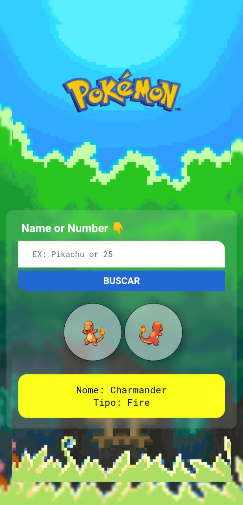
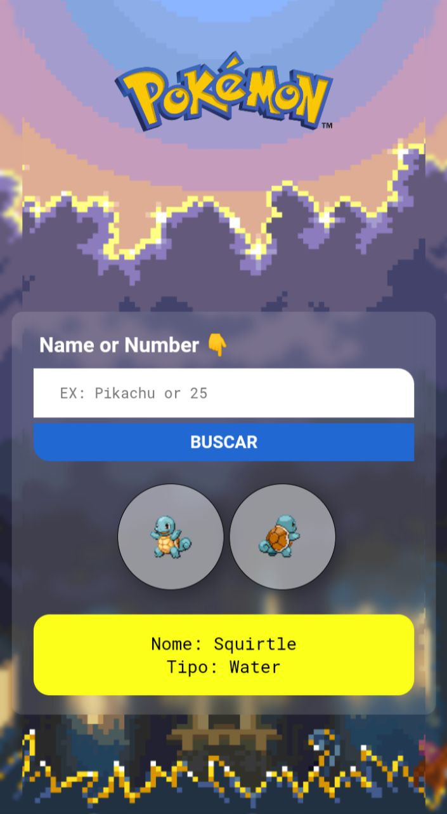
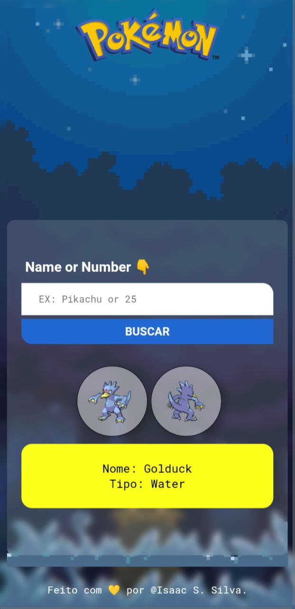

# **Pokedex**
 Projeto utilizando API do Pokemon com Javascript, no qual podemos pesquisar o nome ou o numero do pokemon e ver o nome, o tipo e imagens do pokemon escolhido
##Status
> Finalizado

## Funcionalidades

> * Em um input digite o nome ou o numero do pokemon correspondente desejado
> * O Site ira buscar em uma API os dados e ira retornar na tela
> * Responsividade [Em algumas condições em aparelhos mobile podera apresentar instabilidade]

## Preview
>  
>  
> 
>  
> 
>
> 
> 
